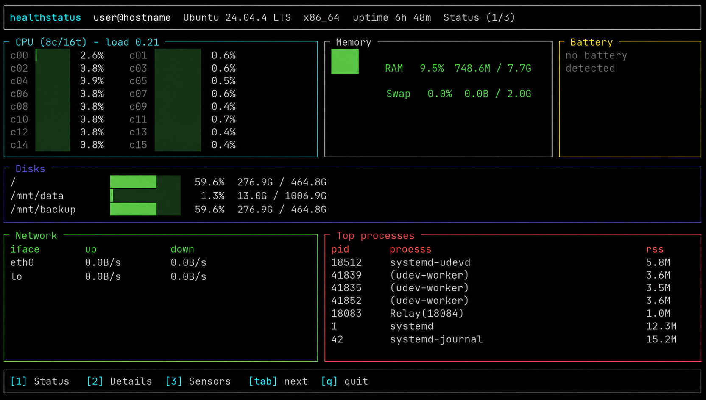
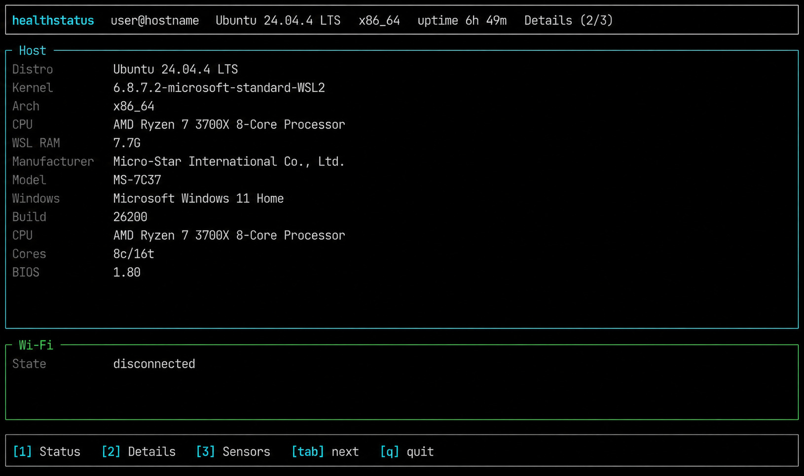
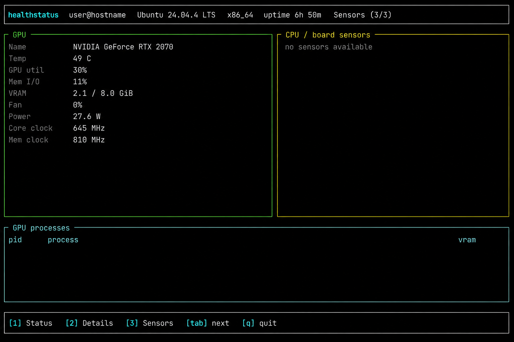

# healthstatus

[](https://github.com/emilindqvist/healthstatus/actions/workflows/ci.yml)
[](https://crates.io/crates/healthstatus)
[](LICENSE)

Live terminal dashboard for machine health, now implemented in Rust.

It shows CPU, memory, disk, network, uptime, battery, top processes, system
details, and NVIDIA GPU telemetry from a single `healthstatus` command.
CPU, memory, disk, and temperature warnings are highlighted when they cross
high-usage thresholds.

## Install

From crates.io:

```bash
cargo install healthstatus
```

From GitHub:

```bash
cargo install --git https://github.com/emilindqvist/healthstatus.git
```

From a local checkout:

```bash
cargo install --path .
```

Update an existing install:

```bash
cargo install healthstatus --force
cargo install --git https://github.com/emilindqvist/healthstatus.git --force
```

`cargo update healthstatus` updates dependency versions in another Cargo
project; it does not update an installed `healthstatus` command.

For local development:

```bash
cargo run -- --once
cargo run -- --sensors
cargo test
```

Package name: `healthstatus`  
Command name: `healthstatus`

## Dependencies

- Rust and Cargo are required to install from crates.io or source.
- Rust crate dependencies are resolved automatically by Cargo.
- Disk usage is read with `df` when available.
- NVIDIA GPU telemetry is optional and requires `nvidia-smi` or
  `nvidia-smi.exe` on `PATH`.
- On WSL, battery, Windows system details, and Wi-Fi details are optional and
  use `powershell.exe` and `netsh.exe` when available.

## Use

```bash
healthstatus                     # live dashboard, q / Ctrl-C to quit
healthstatus --once              # one status snapshot, then exit
healthstatus --once --details    # one system details snapshot
healthstatus --once --sensors    # one sensors snapshot
healthstatus --json              # raw metrics as JSON
healthstatus --json --details    # include system details in JSON
healthstatus --json --sensors    # include GPU telemetry in JSON
healthstatus --interval 0.5      # refresh every 0.5s
healthstatus --log metrics.csv   # append sampled metrics to a CSV file
healthstatus --version           # print version
```

Live mode keys:

```text
1      Status
2      Details
3      Sensors
tab    Next page
q      Quit
```

## Metrics

- CPU shows current total CPU utilization. In WSL, this reflects the WSL2 VM.
- Memory shows used and total RAM as reported by the host environment.
- Disk shows mounted filesystem usage when `df` is available.
- Network shows receive/transmit rates calculated between samples.
- Uptime is read from the operating system uptime source.
- Battery reports charge and charging state when battery data is available.
- Top processes are ranked by sampled CPU and memory usage.
- Details shows operating system, CPU, board, BIOS, Wi-Fi, and Windows host
  details when the platform exposes them.
- Sensors shows NVIDIA GPU temperature, utilization, memory, power, clocks, and
  fan telemetry when `nvidia-smi` is available.
- `--log <FILE>` appends CSV samples with CPU, memory, swap, disk, network, and
  battery metrics. In live mode it writes one row per refresh interval.
- Warnings are emitted for CPU, RAM, disks, and temperatures at high-usage
  thresholds.

## Screenshots







## WSL notes

- CPU and RAM reflect the WSL2 VM, not the full Windows host.
- Disks include Linux and mounted Windows drives when `df` reports them.
- Battery info in WSL is read from Windows through `powershell.exe`.
- System details in WSL use `powershell.exe` and Wi-Fi details use `netsh.exe`.
- GPU telemetry is primarily NVIDIA-focused and requires `nvidia-smi` or
  `nvidia-smi.exe` on `PATH`.
- CPU/board temperatures are best-effort from Linux thermal sysfs and are often
  unavailable inside WSL.

## Architecture

- `src/main.rs` parses CLI arguments and routes commands.
- `src/collectors.rs` gathers metrics from Linux, WSL, Windows helper tools,
  and GPU tools.
- `src/render.rs` formats status, details, sensors, and JSON output.
- `src/live.rs` runs the interactive terminal dashboard.
- `tests/` contains integration tests for formatting and parser behavior.

## Roadmap

- Evaluate `sysinfo` for portable CPU, memory, disk, process, and system
  details to reduce direct shell command usage.
- Add AMD GPU telemetry through `rocm-smi`.
- Add configurable warning thresholds.
- Add config file support at `~/.config/healthstatus/config.toml`.
- Document and test macOS support explicitly.
- Add release automation with GitHub Releases and prebuilt binaries, for
  example through `cargo-dist` or `release-plz`.
- Add hardware-independent collector tests using mocked system data.
- Add an animated GIF or short video of the live dashboard.

## Development

```bash
cargo fmt --check
cargo clippy --all-targets -- -D warnings
cargo test
```

The GitHub Actions workflow runs those same checks on push and pull request.
